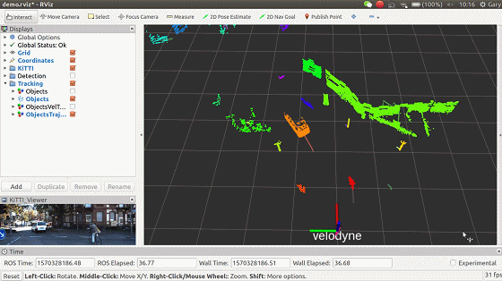
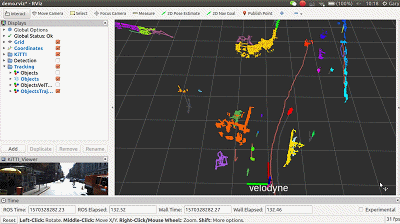

# tracking_lib
　　The LiDAR tracking library, for tracking objects obtaining from segmentation-based detection and improve segmentation.
<p align="center">
    
    
</p>

## How to use
1. We name your ros workspace as `CATKIN_WS` and `git clone` as a ROS package.
    ```bash
    $ cd $(CATKIN_WS)
    # we recommand you to organize your workspace as following
    $ mkdir -p src/perception/libs

    # git clone basic common libraries
    $ cd $(CATKIN_WS)/src/
    $ git clone https://github.com/LidarPerception/common_lib.git common

    # git clone perception libraries, tracking_lib and its dependencies
    $ cd $(CATKIN_WS)/src/perception/libs
    $ git clone https://github.com/LidarPerception/roi_filters_lib.git roi_filters
    $ git clone https://github.com/LidarPerception/object_builders_lib.git object_builders
    $ git clone https://github.com/LidarPerception/segmenters_lib.git segmenters
    $ git clone https://github.com/LidarPerception/feature_extractors_lib.git feature_extractors
    $ git clone https://github.com/LidarPerception/tracking_lib.git tracking

    # build your ros workspace for our Tracking-help segmentation demo
    $ cd $(CATKIN_WS)
    $ catkin build -DCMAKE_BUILD_TYPE=Release
    ```
2. Run demo under [KiTTI raw dataset](http://www.cvlibs.net/datasets/kitti/raw_data.php) using [kitti_ros](https://github.com/LidarPerception/kitti_ros.git)'s replayer.
    + **Terminal 1**: KiTTI raw dataset replay, [more tutorials](https://github.com/LidarPerception/kitti_ros#how-to-use).
        ```bash
        $ cd $(CATKIN_WS)
        $ source devel/setup.bash
        # change Mode for Keyboard Listening Device
        $ sudo chmod 777 /dev/input/event3
        # launch kitti_ros's kitti_player for frame-by-frame algorithm testing
        $ roslaunch kitti_ros kitti_player.launch kitti_data_path:=<path-to-your-downloaded-raw-dataset> fps:=1
        ```
    + **Terminal 2**: launch **Tracking-help Segmentation** demo.
        ```bash
        $ cd $(CATKIN_WS)
        $ source devel/setup.bash
        $ roslaunch tracking_lib demo.launch
        ```

## [Parameters](./launch/demo.launch)
　*detection.yaml* and *tracking.yaml* configure the detection_node and tracking_node in sample. *kitti/\*.yaml* configure the algorithm parameters for KiTTI Dataset, *Segmenter.yaml* and *TrackingWorker.yaml* separately for **Seg-based Segmentation**, **Tracking**.
```bash
./config
├── detection.yaml
├── kitti
│   ├── Segmenter.yaml
│   └── TrackingWorker.yaml
└── tracking.yaml
```

## TODO lists
### Non-ground Segmenters
- [x] **Tracking-help Segmentation**. IV, 2012. Not yet in this repository.
    ```bibtex
    @inproceedings{himmelsbach2012tracking,
      title={Tracking and classification of arbitrary objects with bottom-up/top-down detection},
      author={Himmelsbach, Michael and Wuensche, H-J},
      booktitle={Intelligent Vehicles Symposium (IV), 2012 IEEE},
      pages={577--582},
      year={2012},
      organization={IEEE}
    }
    ```
    <p align="center">
        
    </p>
